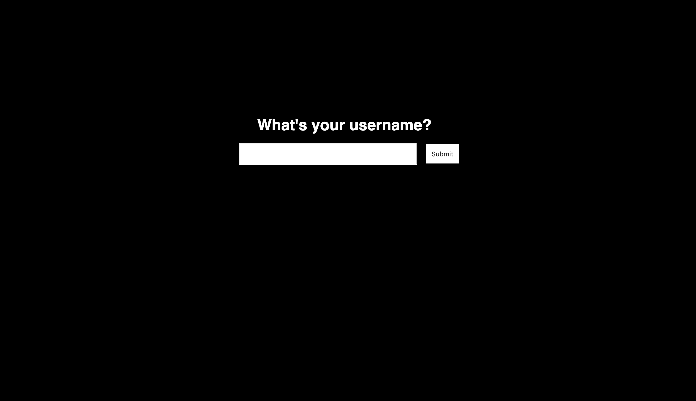
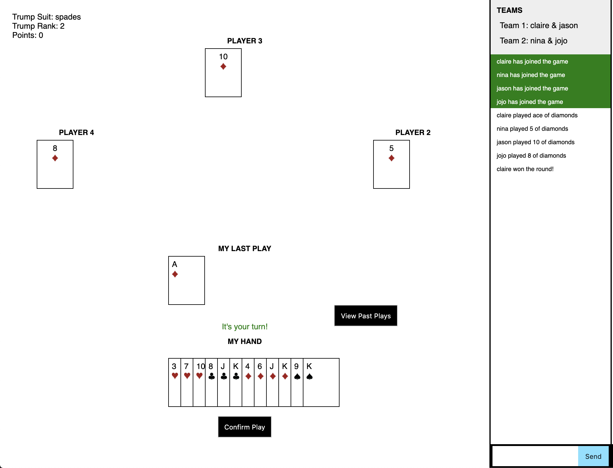
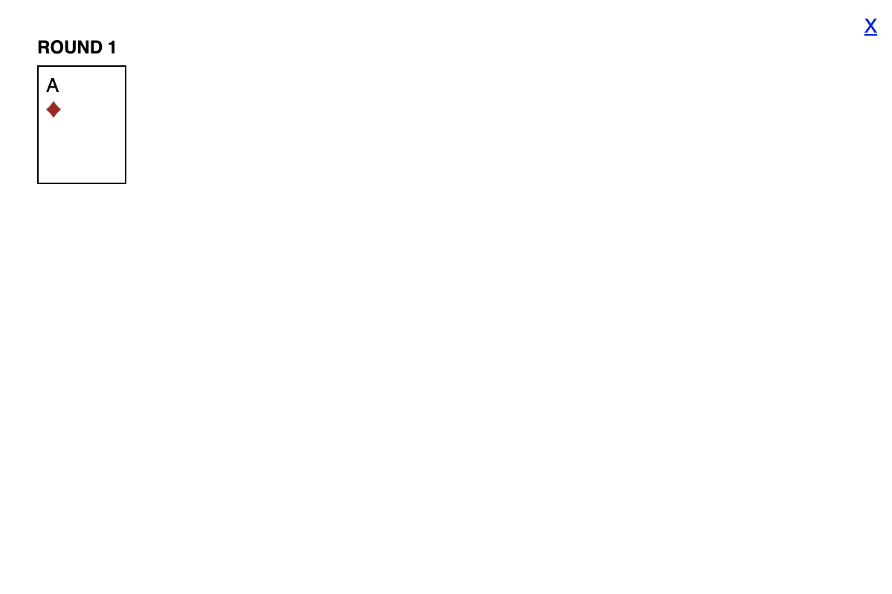

# Online Sheng Ji

## Overview

My family and I have a tradition where we play a Chinese card game at family get-togethers. Since my sister and I started college and my parents moved back to China, we rarely get the chance to play this game anymore. Therefore, Sheng Ji is a web app where you can play this game online.


## Data Model

The application will store Users, Teams, Rounds, and Games

* teams have lists of users
* teams have a corresponding game
* games have lists of rounds and teams

An Example User:

```javascript
{
  username: "clairewang",
  password: // password,
}
```

An Example Team with Embedded Items:

```javascript
{
  name: "team1",
  users: [
    { name: "clairewang"},
    { name: "ninawang"},
  ],
  game: 01234 // reference to a game
}
```

An Example Round with Embedded Items:

```javascript
{
  game_id: 01234,
  round_number: 1,
  started: 2, //id of player who started
  suit: 'spades', //suit of round
  cards: [
    //array of cards played in this round
  ], //temporary number of 
  points: // points earned during this round
  winner: //who won the round
}
```

An Example Game with Embedded Items:

```javascript
{
  game_id: 01234,
  rounds: [
    //list of rounds
  ],
  teams: [
    //list of teams (reference to team items)
  ]
  points: // points accumulated so far during the game
  turn: //whose turn is it
  round_index: //which round was in progress
}
```


## [Link to Commented First Draft Schema](db.js) 

## Wireframes

/list - page to login



/list/create - main page for online game



/list - page for seeing past moves



## Site map

My app only has one page, index.html.

## User Stories or Use Cases

1. as non-registered user, I can register a new account with the site
2. as a user, I can log in to the site
3. as a user, I can start a game
4. as a user, I can join a game
5. as a user, I can join a team
6. as a user, I can make moves in a game
7. as a user, I can view my past moves
8. as a user, I can chat with other users in the game

## Research Topics

* (2 points) Use a CSS preprocesser
    * I'm going to be using SASS
* (5 points) Use a Javascript library
    * I'm using socket.io to communicate with the server from the client-side
* (3 points) Perform client side form validation using custom JavaScript or JavaScript library
    * I'm going to validate the plays before they get sent to the server to make sure that they follow the rules

10 points total out of 8 required points

## [Link to Initial Main Project File](index.js) 

## Annotations / References Used

1. [basic socket.io chat application](https://socket.io/get-started/chat/) - (index.js)
